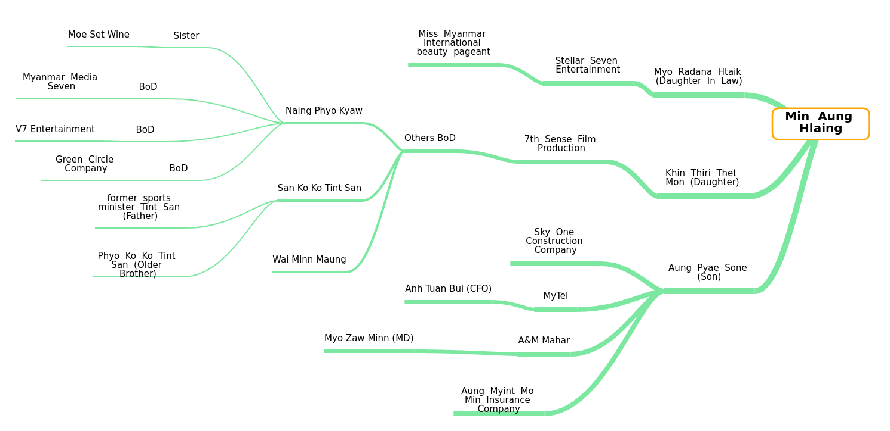

# Myanmar Military Business List

This repo is intended to list all the businesses directly involved with Myanmar/Burmese Military.

[View Website](https://freedomformyanmar.github.io/military-biz-list/)

## Connection between Immediate Family Member and Their respective Businesses



## Social Media Pages

### Personal

- Myo Radana Htaik - https://twitter.com/myoradana
- San Ko Ko Tint San - https://www.facebook.com/sankokotintsan.kosan

### Company

- Sky One Construction Company - https://www.facebook.com/SkyOneConstruction/
- A&M Mahar - https://www.facebook.com/myanmardistributor

### We urge the people of Myanmar to open issues for better ideas.

### Send Pull Requests to fix/add the list.

### Data-Contribution

- Please find the data category in data folder before you create new file
- if you couldnt find the data category please create a file inside data with file name of category
  - eg. food-n-beverages.json
- Append your file name array inside `businesses.js`

  - ```js
    var businessJsonsPromises = [
      "banking-n-finance.json",
      "cigarettes.json",
      "communications.json",
      "constructions.json",
      "entertainment-n-tourism.json",
      "food-n-beverages.json",
      "health-n-beauty-product.json",
      "health-services.json",
      "industrial-estates-offices.json",
      "manufacturing.json",
      "media.json",
      "port-terminals.json",
      "retail.json",
      "trading-companies.json",
      "transport.json",
      "yournewjsonfile.json",
    ].map((i) => fetch(`data/${i}`).then((response) => response.json()));
    ```

- Append your updated data into an array
- Add new category inside index.html
  - ```js
    Promise.all(businessJsonsPromises).then((values) => {
      var businesses = Object.freeze({
        Cigarettes: values[0],
        "Entertainment/Tourism": values[1],
        "Food and drink": values[2],
        Media: values[3],
        Transport: values[4],
        Retail: values[5],
        "Health Servcies": values[6],
        "Banking and finance": values[7],
        Communications: values[8],
        Construction: values[9],
        Port: values[10],
        Manufacturing: values[11],
        "Trading companies": values[12],
        "Health and Beauty Products": values[13],
        "Industrial Estates/Offices": values[14],
        "Your category Name": values[15],
      });
    ```
- Send PR
